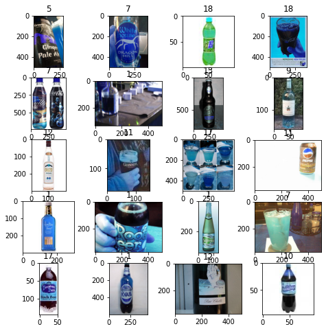
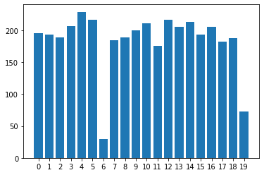

# Baseline for Fine-grained Image Classification

Data pulled from here: https://github.com/AndresPMD/Fine_Grained_Clf

Data sample
<p align="left">
            
</p> 

Data label distribution
<p align="left">
            
</p> 

results

OVERALL mAP
```
dataset | baseline | theirs
--------+----------+-------
bottle  | 63.70    | 73.41
context | 75.13    | 70.96
```

for Resnet-18 as baseline model: splits

BOTTLE
```
              precision    recall  f1-score   support

           0       0.63      0.68      0.65       443
           1       0.65      0.66      0.66       369
           2       0.90      0.86      0.88       412
           3       0.92      0.92      0.92       423
           4       0.45      0.79      0.57       218
           5       0.85      0.71      0.78        63
           6       0.61      0.35      0.44       147
           7       0.74      0.51      0.61       341
           8       0.49      0.62      0.54       138
           9       0.80      0.79      0.79       378
          10       0.70      0.56      0.62       111
          11       0.84      0.34      0.49        79
          12       0.77      0.68      0.72       418
          13       0.90      0.90      0.90       492
          14       0.59      0.52      0.55       352
          15       0.53      0.68      0.59       151
          16       0.81      0.69      0.74       303
          17       0.69      0.82      0.75       444
          18       0.83      0.86      0.85       425
          19       0.79      0.81      0.80       455

    accuracy                           0.73      6162
   macro avg       0.72      0.69      0.69      6162
weighted avg       0.75      0.73      0.73      6162
```

CONTEXT
```

              precision    recall  f1-score   support

           0       0.96      0.85      0.90       404
           1       0.86      0.93      0.90       524
           2       0.62      0.98      0.76        95
           3       0.89      0.93      0.91       444
           4       0.75      0.70      0.73       279
           5       0.92      0.85      0.89        95
           6       0.85      0.80      0.83       408
           7       0.88      0.87      0.87       378
           8       0.67      1.00      0.80        14
           9       0.71      0.84      0.77       398
          10       0.87      0.92      0.89       330
          11       0.73      0.92      0.81        24
          12       0.94      0.87      0.90        92
          13       0.82      0.92      0.87       403
          14       0.86      0.80      0.83       389
          15       0.87      0.87      0.87       165
          16       0.96      0.91      0.93       208
          17       0.93      0.78      0.85       425
          18       0.95      0.86      0.90       380
          19       0.95      0.81      0.88       256
          20       0.89      0.78      0.83       400
          21       0.88      0.87      0.88       461
          22       0.59      0.95      0.73       108
          23       0.91      0.76      0.83        78
          24       0.83      0.86      0.85       236
          25       0.96      0.94      0.95       464
          26       0.81      0.74      0.78       242
          27       0.83      0.94      0.88       376

    accuracy                           0.86      8076
   macro avg       0.85      0.87      0.85      8076
weighted avg       0.87      0.86      0.86      8076
```

